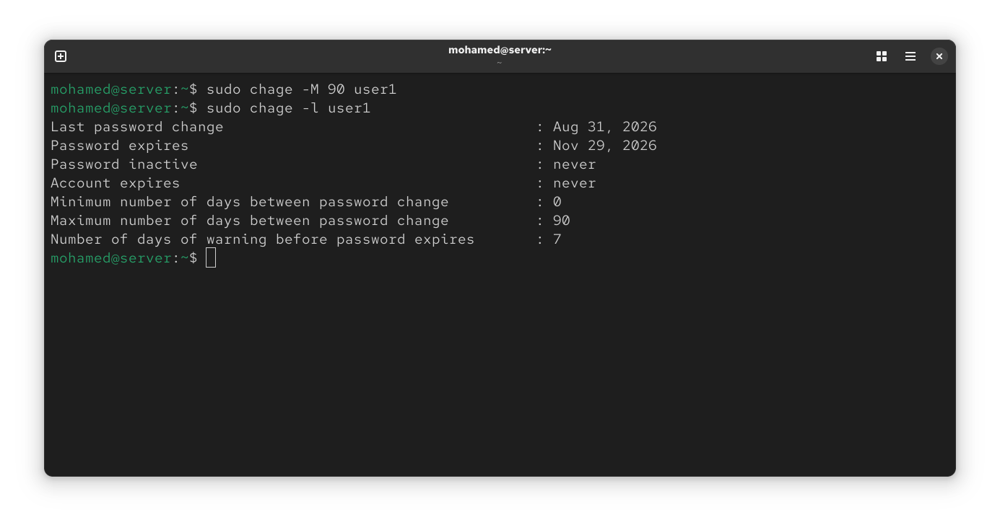

# RHCSA Preparation Labs (EX200)

## Day 1: systemd Services & journalctl Logging

### Objectives
- Manage system services using systemctl (start, stop, enable, disable, mask, unmask).
- Analyze boot time performance using systemd-analyze.
- Filter and inspect system logs using journalctl.

### Commands Executed
```bash
# Service Control & Boot Analysis
systemctl status httpd
systemctl start httpd
systemctl enable httpd 
systemctl is-enabled httpd
systemctl is-active httpd
systemd-analyze blame

# Log Filtering (RHCSA Core)
journalctl -u sshd
journalctl -b
journalctl -p err

```
### Visual Verification


## Day 2: LVM Basics & Storage Management

### Objectives
- Create Physical Volumes (PV), Volume Groups (VG), and Logical Volumes (LV).
- Format LVs with ext4 and configure persistent mounting via /etc/fstab.
- Perform Live Expansion (lvextend).
- Clean up LVM components safely.

### Commands Executed
```bash
# 1. Physical & Volume Group Creation
pvcreate /dev/nvme0n2
vgcreate test-vg /dev/nvme0n2

# 2. Logical Volume Creation & Formatting
lvcreate -L 2G -n test-lv test-vg
mkfs.ext4 /dev/test-vg/test-lv
mkdir /test-data
mount /dev/test-vg/test-lv /test-data

# 3. Expansion & Full Cleanup
lvextend -L 4G -r /dev/test-vg/test-lv
umount -l /test-data
lvremove -f /dev/test-vg/test-lv
vgremove test-vg
pvremove /dev/nvme0n2
```
### Visual Verification


## Day 3: User & Group Management, Permissions & ACLs

### Objectives
* Perform local user account creation, group assignment, and password management.
* Manage group creation, renaming, and deletion.
* Configure directory ownership, special permissions (SGID), and ACLs.

---

### Task Breakdown & Commands

1. User Management & Primary Group Assignment:
   Created user1 with a home directory, verified its identity, created a primary group Security, and set the user's password.
   ```bash
   sudo useradd -m user1
   ls /home
   id user1
   sudo groupadd Security
   sudo usermod -g Security user1
   id user1
   sudo passwd user1

2. Group Operations:
Demonstrated group creation, renaming (DevOps to Sec), and deleting redundant groups.   
```
sudo groupadd DevOps
sudo groupmod -n Sec DevOps
sudo groupdel Sec
```
3. Directory Ownership & SGID Configuration:
Created /data/project, assigned group ownership to devops, and applied the SGID bit (2770) so new files inherit the group identity.

```bash
sudo mkdir -p /data/project
sudo chown -R root:devops /data/project
sudo chmod 2770 /data/project
```
4. Access Control Lists (ACL):
Configured granular read and execute permissions (r-x) for otheruser using setfacl.

```bash
sudo setfacl -m u:otheruser:rx /data/project
getfacl /data/project
```
### Visual Verification

* **User Management (useradd, usermod, passwd):**
  
  
  

* **Group Management (groupadd, groupmod, groupdel):**
  

* **SGID & ACLs Configuration (chmod 2770, setfacl):**
  
  
