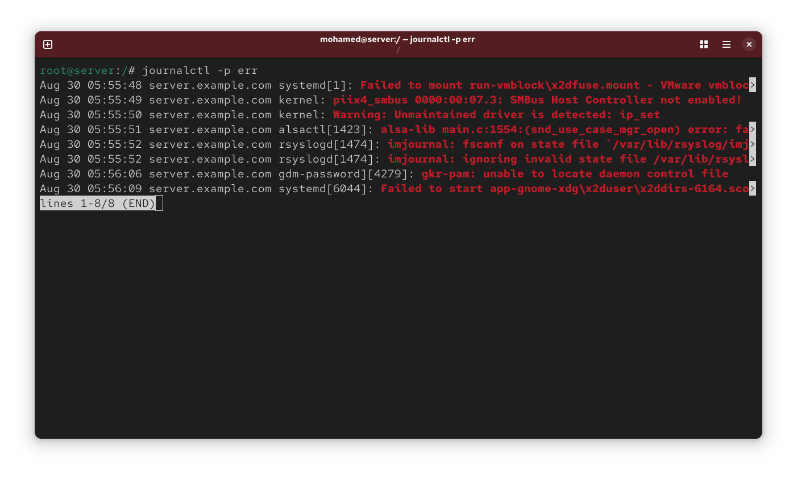
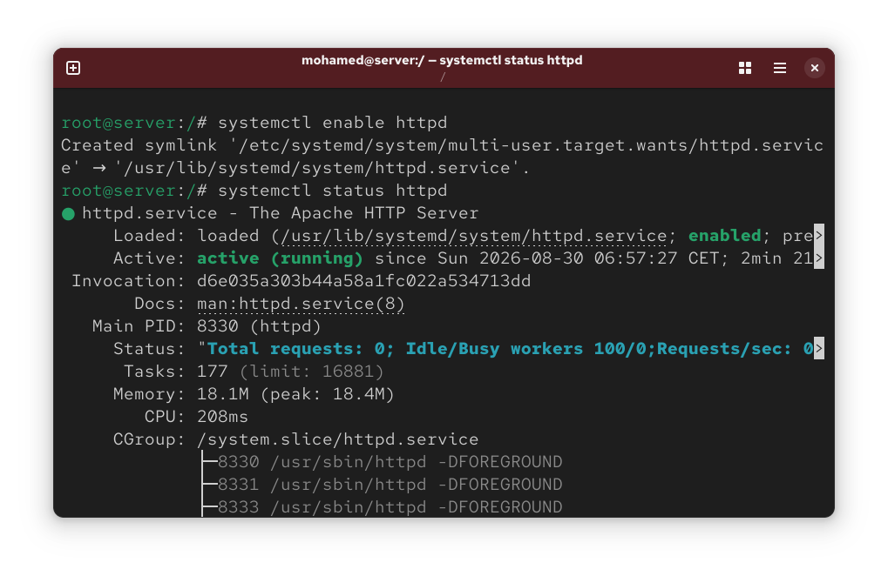
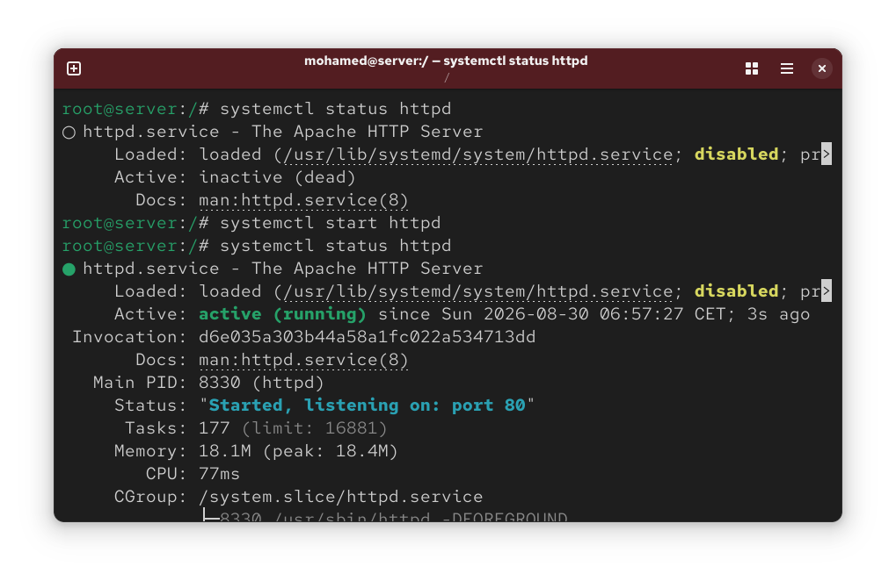
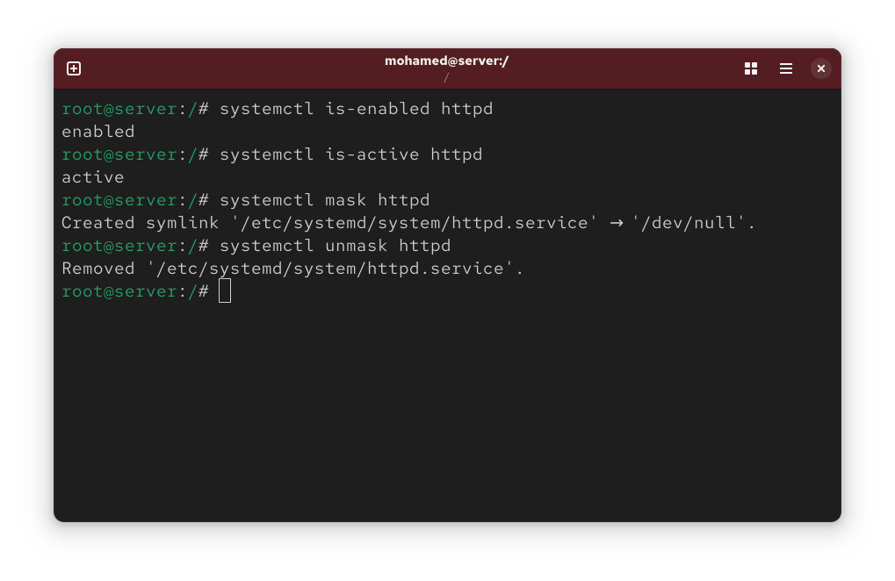
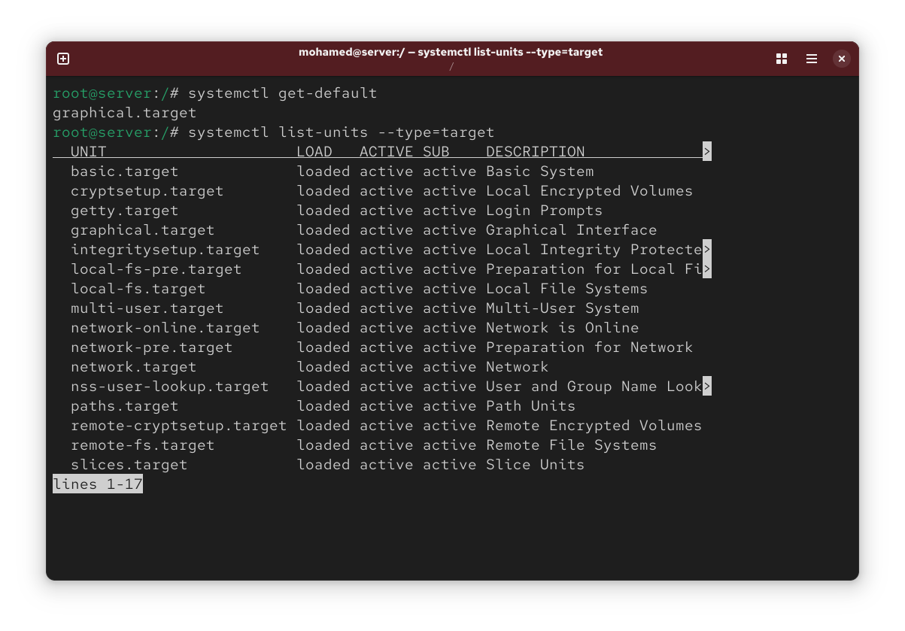
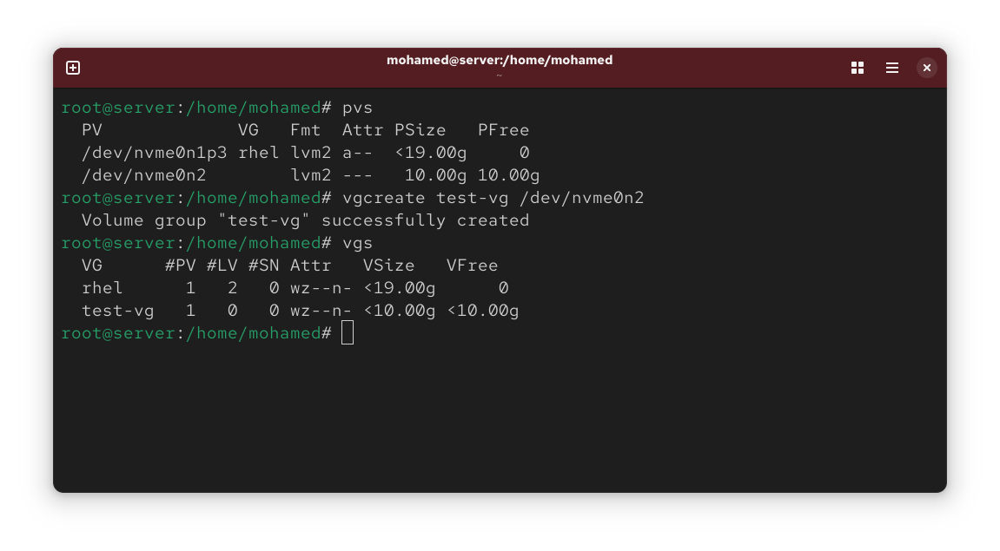
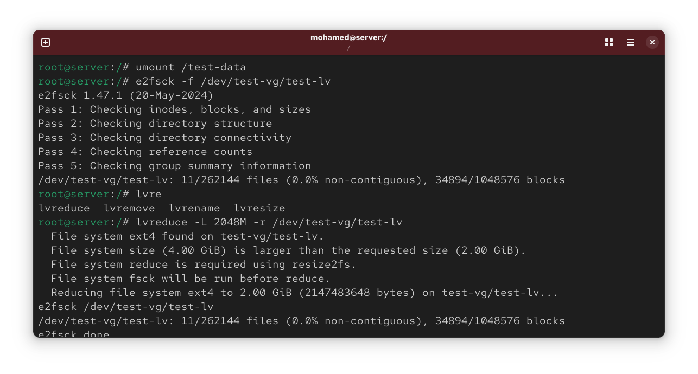
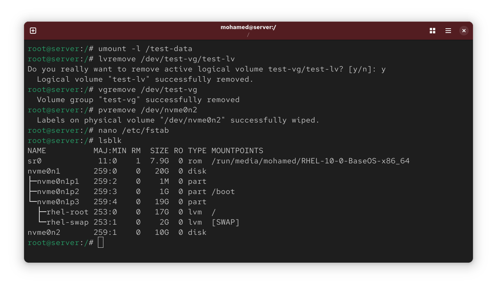

# RHCSA Preparation Labs (EX200)

## Day 1: systemd Services & journalctl Logging

### Objectives
- Manage system services using systemctl (start, stop, enable, disable, mask, unmask).
- Analyze boot time performance using systemd-analyze.
- Filter and inspect system logs using journalctl.

### Commands Executed
```bash
# Service Control & Boot Analysis
systemctl status httpd
systemctl start httpd
systemctl enable httpd 
systemctl is-enabled httpd
systemctl is-active httpd
systemd-analyze blame

# Log Filtering (RHCSA Core)
journalctl -u sshd
journalctl -b
journalctl -p err

```
### Visual Verification








## Day 2: LVM Basics & Storage Management

### Objectives
- Create Physical Volumes (PV), Volume Groups (VG), and Logical Volumes (LV).
- Format LVs with ext4 and configure persistent mounting via /etc/fstab.
- Perform Live Expansion (lvextend).
- Clean up LVM components safely.

### Commands Executed
```bash
# 1. Physical & Volume Group Creation
pvcreate /dev/nvme0n2
vgcreate test-vg /dev/nvme0n2

# 2. Logical Volume Creation & Formatting
lvcreate -L 2G -n test-lv test-vg
mkfs.ext4 /dev/test-vg/test-lv
mkdir /test-data
mount /dev/test-vg/test-lv /test-data

# 3. Expansion & Full Cleanup
lvextend -L 4G -r /dev/test-vg/test-lv
umount -l /test-data
lvremove -f /dev/test-vg/test-lv
vgremove test-vg
pvremove /dev/nvme0n2
```
### Visual Verification






